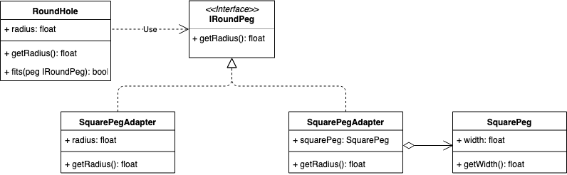

# Adapter Pattern
装饰器模式

- [Adapter Pattern](#adapter-pattern)
  - [概念](#概念)
  - [使用场景](#使用场景)
  - [实现方式](#实现方式)
    - [Java Sample](#java-sample)
    - [Golang Sample](#golang-sample)
  - [类图](#类图)
  - [总结反思](#总结反思)

## 概念
将不兼容的接口转换为可兼容的接口，让原本由于接口不兼容而不能一起工作的类可以一起工作。

> 别名也称为封装器模式

## 使用场景
* 适配不同格式数据；
* 封装有缺陷的设计接口：对接口进行二次封装以抽象出更好的接口；
* 统一多个类的接口设计：统一接口并利用多态特性复用代码逻辑；
* 替换依赖的外部系统or兼容老版本系统：基于接口而非实现编程，从而以最小改动代码的代价进行迭代；

## 实现方式
我们通过一个例子来看看如何通过适配器模式来让不兼容的圆孔和方形钉子如何合作：

### Java Sample

<details>

```java
public interface IRoundPeg {
  public double getRadius()
}

// 圆孔
public class RoundHole {
  private double radius;

  public RoundHole(double radius) {
    this.radius = radius;
  }

  public double getRadius() {
    return radius;
  }

  public boolean fits(IRoundPeg peg) {
    boolean result;
    result = (this.getRadius() >= peg.getRadius());
    return result;
  }
}

// 圆钉
public class RoundPeg implements IRoundPeg {
  private double radius;

  public RoundPeg(double radius) {
    this.radius = radius;
  }

  public double getRadius() {
    return radius;
  }
}

// 方钉
public class SquarePeg {
  private double width;

  public SquarePeg(double width) {
    this.width = width;
  }

  public double getWidth() {
    return width;
  }

  public double getSquare() {
    double result;
    result = Math.pow(this.width, 2);
    return result;
  }
}

// 方钉适配器
public class SquarePegAdapter implements IRoundPeg {
  private SquarePeg peg;

  public SquarePegAdapter(SquarePeg peg) {
    this.peg = peg;
  }

  @Override
  public double getRadius() {
    double result;
    // Calculate a minimum circle radius, which can fit this peg.
    result = (Math.sqrt(Math.pow((peg.getWidth() / 2), 2) * 2));
    return result;
  }
}

RoundHole hole = new RoundHole(5);
SquarePegAdapter pegAdapter = new SquarePegAdapter(new SquarePeg(2););
hole.fits(pegAdapter)

```

</details>

### Golang Sample

<details>

```golang
type IRoundPeg interface {
  getRadius() float64
}

// 原孔
type RoundHole struct {
  radius float64
}

func (roundHole *RoundHole) getRadius() float64 {
  return roundHole.radius
}

func (roundHole *RoundHole) fits(peg IRoundPeg) bool {
  return roundHole.getRadius() >= peg.getRadius()
}

// 原钉
type RoundPeg struct {
  radius float64
}

func (roundPeg *RoundPeg) getRadius() float64 {
  return roundPeg.radius
}

// 方钉
type SquarePeg struct {
  width float64
}

func (squarePeg *SquarePeg) getWidth() float64 {
  return squarePeg.width
}

func (squarePeg *SquarePeg) getSquare() float64 {
  return math.Pow(squarePeg.width, 2)
}

// 方钉装饰器
type SquarePegAdapter struct {
  SquarePeg
}

func (adapter SquarePegAdapter) getRadius() float64 {
  return math.Sqrt(math.Pow(adapter.SquarePeg.getWidth()/2, 2) * 2)
}

func BuildSquarePegAdapter(squarePeg SquarePeg) IRoundPeg {
  return SquarePegAdapter{SquarePeg: squarePeg}
}

func main() {
  hole := RoundHole{radius: 5}
  squarePeg := BuildSquarePegAdapter(SquarePeg{width: 5})
  fmt.Println(hole.fits(squarePeg))
}
```

</details>

## 类图



## 总结反思

适配器模式运行我们通过创建一个中间层，作为代码与其他类之间的转换器，从而让原本由于接口不兼容的代码可以一起工作。一般来说适配器模式可以看做是一种补充模式，用来补救设计上的缺陷。如果在设计初期，可以通过其他方法来规避接口不兼容的问题，不需要用上适配器模式。

适配器模式和之前讲的代理模式、桥接模式、装饰器模式是比较常用的结构型设计模式，且代码结构非常类似，笼统来说都是通过包装类来对原始类进行二次封装。尽管它们的代码结构相似，但用意却完全不同，也就是说解决的问题、应用场景不同，也就是它们的主要区别：
* 代理模式：代理模式在不改变原始类结构的条件下，为原始类定义了一个代理类，主要目的是控制访问，而非加强功能，这是它和装饰器模式的最大不同；
* 桥接模式：桥接模式的目的是将接口部分和实现部分分离，从而让他们可以较为容易和独立地加以改变；
* 装饰器模式：装饰器模式在不改变原始类接口的情况下，对原始类的功能进行加强，并且支持多个装饰器的嵌套使用；
* 适配器模式：适配器模式是一种事后的补救策略，适配器提供与原始类不同的接口，而代理模式、装饰器模式提供的都是跟原始类相同的接口；
