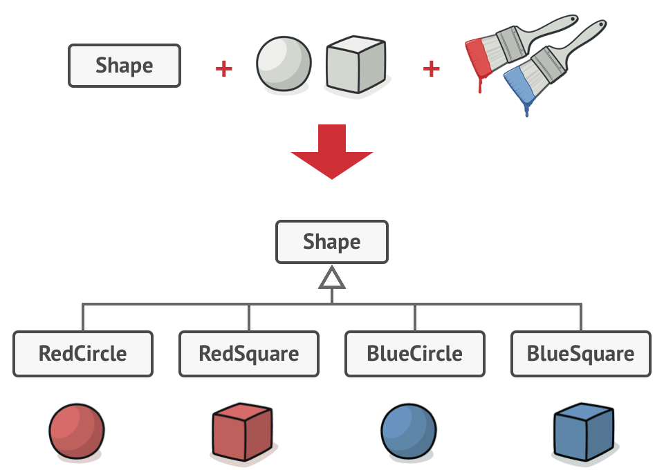
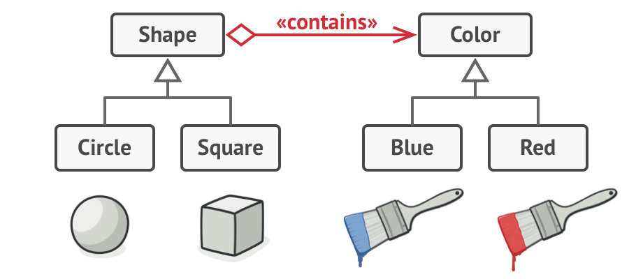
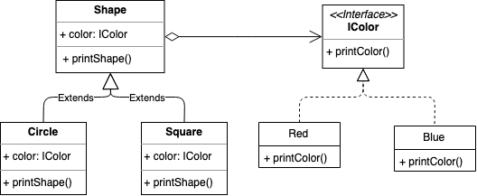

# Bridge Pattern
桥接模式

> 别名又称为桥梁模式

- [Bridge Pattern](#bridge-pattern)
  - [概念](#概念)
  - [使用场景](#使用场景)
  - [实现方式](#实现方式)
    - [Java Sample](#java-sample)
    - [Golang Sample](#golang-sample)
    - [总结反思](#总结反思)
  - [类图](#类图)
  - [总结反思](#总结反思-1)

## 概念
官方定义为将抽象和实现解耦，让它们可以独立变化，而更加通用的解释为当一个类存在两个或多个独立变化的维度时，我们可以通过组合的方式让它们（维度）可以独立扩展。

## 使用场景
+ 类存在多个独立变化的维度&每个维度都需要进行扩展；
+ 不希望通过使用继承or多继承导致系统类的个数急剧增加的场景；

## 实现方式

假如我们有一个形状类Shape，它从拓展出两个子类：圆形和方形，此时需要对颜色维度进行拓展时，我们很容易设计出以下这样的结构：



此时形状维度存在原型和方形，颜色维度存在红色和蓝色时，我们就需要创建4（m*n）个类才能覆盖所有的组合，如果我们新增形状或则颜色时，情况将会变得越来越复杂。此时桥接模式就可以登场了，我们可以通过抽取其中一个维度成为一个独立的层次，并通过组合的形式让初始类拥有其他维度的状态和行为，示意图如下：


### Java Sample

<details>

```java
public interface IColor {
  void printColor()
}

public class Blue implements Color {
  @Override
  public void printColor() {
    System.out.println("blue color");
  }
}

public class Red implements Color {
  @Override
  public void printColor() {
    System.out.println("red color");
  }
}

public interface IShape {
  void printShape()
}

public class Shape implements IShape {
  private IColor color
  public Circle(IColor color) {
    this.color = color;    
  }

  public void printShape() {}
}

public class Circle extends Shape {
  private IColor color
  public Circle(IColor color) {
    this.color = color;    
  }

  @Override
  public void printShape() {
    this.color.printColor()
    System.out.println("circle Shape");
  }
}

public class Square extends Shape {
  private IColor color
  public Circle(IColor color) {
    this.color = color;    
  }

  @Override
  public void printShape() {
    this.color.printColor()
    System.out.println("Square Shape");
  }
}

Circle redCircle = new Circle(new red())
Circle blueCircle = new Circle(new Blue())
Shape redShape = new Shape(new red())
Shape blueShape = new Shape(new Blue())
```

</details>

### Golang Sample

<details>

```golang
type IColor interface {
   printColor()
}

type Blue struct{}

func (Blue) printColor() {
   fmt.Println("blue color")
}

type Red struct{}

func (Red) printColor() {
   fmt.Println("red color")
}

type IShape interface {
   printShape()
}

type Shape struct {
   color IColor
}

type Circle struct {
   Shape
}

func (circle Circle) printShape() {
   circle.color.printColor()
   fmt.Println("circle shape")
}

func BuildCircle(color IColor) IShape {
   return Circle{Shape{color: color}}
}

type Square struct {
   Shape
}

func (square Square) printShape() {
   square.color.printColor()
   fmt.Println("square shape")
}

func BuildSquare(color IColor) IShape {
   return Square{Shape{color: color}}
}

func main() {
   redCircle := BuildCircle(new(Red))
   blueCircle := BuildCircle(new(Blue))
   redSquare := BuildSquare(new(Red))
   blueSquare := BuildSquare(new(Blue))
   redCircle.printShape()
   blueCircle.printShape()
   redSquare.printShape()
   blueSquare.printShape()
}
```

</details>

### 总结反思
通过组合关系来替代继承关系，避免继承层次的暴涨，和我们提到的组合优于继承的设计原则非常接近。官方对桥接模式的定义比较难理解，我们可以简单地：
+ Shape为抽象部分，提供高层控制逻辑，依赖于完成底层实际工作的实现对象；
+ Circle和Square为具体抽象部分，通过实现接口与不同的实现交互；
+ IColor为实现部分，为所有具体实现声明通用接口；
+ Red和Blue为具体实现部分；

Shape和IColor之间的组合关系，就像是桥梁一样连接着两个维度之间的关系，这就是桥接模式的精髓。

## 类图


## 总结反思

+ 桥接模式的代码实现很简单，但是官方的定义理解比较有点难度，应用场景也不多。而另一种理解方式更加简单，类似组合优于继承设计原则，应用场景也比较多。不管哪种理解方式，他们的代码结构都是相同的，都是类之间的组合关系；
+ 与多层继承不同，桥接模式将多个独立变化的维度设计为多个独立的继承结构，并且在抽象层建立一个抽象关联用于连接多个独立的继承结构。即用抽象关联来取代了多层继承，将类之间的静态关系转化为动态的组合关系。但该模式可能会使代码在可读性上会受到一定的影响；