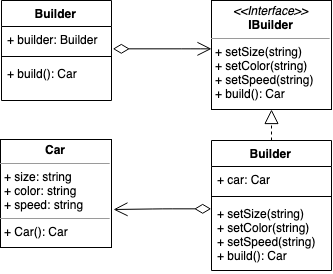

# Builder Pattern
建造者模式

- [Builder Pattern](#builder-pattern)
  - [概念](#概念)
  - [使用场景](#使用场景)
  - [实现方式](#实现方式)
    - [Java Sample](#java-sample)
    - [Golang Sample](#golang-sample)
  - [类图](#类图)
  - [反思总结](#反思总结)

## 概念
使用多个简单的步骤来构建成一个复杂的对象，在这个过程中将一个复杂的对象的构建过程和它的属性分离，使得相同的创建过程可以创建出不同的产品/对象。建造者模式又被成为构建者模式、生成器模式等。

## 使用场景
函数/方法/类存在多个变量，且使用时对象会因为参数的顺序、个数的变化而存在变化；

## 实现方式

我们假设存在这样的场景：需要根据用户不同的需求来定制不同汽车，用建造者模式来实现，示例如下：

### Java Sample

```java
// 产品角色，提供基本方法
public class Car {
  private String size;
  private String color;
  private String speed;

  public String getPart1() {
    return part1;
  }
  public void setSize(String size) {
    this.size = size;
  }
  public void setColor(String color) {
    this.color = color;
  }
  public void setSpeed(String speed) {
    this.speed = speed;
  }
}

// 建造者接口
public interface IBuilder {
  public void setSize();
  public void setColor();
  public void setSpeed();
  public Car build();
}

// 建造者角色，实现具体复杂逻辑
public class Builder implements IBuilder {
  private Car car = new Car();

  @Override
  public void setSize() {
    // do something or check
    car.setSize("your car size");
  }
  @Override
  public void setColor() {
    // do something
    car.setColor("your car color");
  }
  @Override
  public void setSpeed() {
    // do something
    car.setSpeed("your car speed");
  }
  @Override
  public Car build() {
    return car;
  }
}

// 导演者角色，负责调用具体的建造者并按照指定顺序进行
public class Director {
  private IBuilder builder;

  public Director(IBuilder builder){
    this.builder = builder;
  }
  // 构造顺序
  public Car construct(){
    builder.setSize();
    builder.setColor();
    builder.setSpeed();
    return builder.build();
  }
}
```

### Golang Sample

```golang
// 产品角色
type Car struct {
  size  string
  color string
  speed string
}
func (car *Car) SetSize(size string) {
  car.size = size
}
func (car *Car) SetColor(color string) {
  car.color = color
}
func (car *Car) SetSpeed(speed string) {
  car.speed = speed
}

// 建造者接口
type IBuilder interface {
  SetSize()
  SetColor()
  SetSpeed()
  Build() *Car
}

// 建造者角色
type Builder struct {
  car *Car
}

func BuildBuilder() IBuilder {
  return Builder{car: new(Car)}
}
func (builder Builder) SetSize() {
  builder.car.SetSize("your car size")
}
func (builder Builder) SetColor() {
  builder.car.SetColor("your car color")
}
func (builder Builder) SetSpeed() {
  builder.car.SetSpeed("your car speed ")
}
func (builder Builder) Build() *Car {
  return builder.car
}

// 导演者
type Director struct {
  builder IBuilder
}

func (director Director) Build() *Car {
  director.builder.SetSize()
  director.builder.SetColor()
  director.builder.SetSpeed()
  return director.builder.Build()
}
```

我们在示例中可以发现这几个角色：
+ 产品角色：它是需要建造的复杂对象（当前例子还算比较简单），提供基本方法；
+ 建造者接口：规范产品对象的建造；
+ 建造者角色：负责具体的建造过程；
+ 导演者角色：负责调用建造者并按照指定顺序建造产品，可以理解成使用者；

建造者在这个过程中更像是一个中间对象，产品角色在这当中只负责部分重要的或是必传的属性，然后通过建造者来接收处理外部信息后完成复杂的构建过程，来达到使产品/对象的属性和创建过程的分离。对开发者来说，建造者隐藏了产品角色的构建细节，同时提升了产品角色的可读性。另外在实际的过程中，笔者更喜欢直接使用建造者而不是通过导演者来规定构建顺序并创建产品，这点随意哈哈。

## 类图


## 反思总结
+ 建造者模式的原理和实现都比较简单，重点是需要掌握应用场景，笔者给出的例子中也不能完全体现建造者的作用，因为例子还不够复杂，完全可以在产品角色（car）中配合set方法来解决，但如果属性之间存在一定的依赖或者约束条件，那么在产品角色中配合set方法容易造成可读性下降，此时我们就可以考虑使用建造者模式；
+ 建造者和工厂模式均是负责对象的创建工作，但在使用的场景上有一定的区 别：工厂模式用来创建类型不同但相关的对象（继承同一父类或者接口的一组子类），由给定的参数来决定哪种类型的对象；而建造者模式是用来创建一种类型复杂对象，通过设置不同参数来定制化地创建不同的对象，它更加注重的是参数的顺序；

