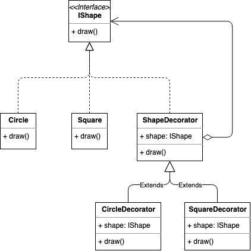

# Decorator Pattern

## 概念
允许向一个现有的对象添加新的功能，同时又不改变其结构，通常我们会通过将对象放入包含封装有特殊行为的对象中来为原对象绑定新的行为。

## 使用场景
* 希望在运行时为对象新增额外的行为&无需修改原对象代码；
* 无法通过继承来拓展对象的行为or实现成本较高的使用场景；

## 实现方式
假设我们存在形状类Shape并且我们希望增强它的draw方法，示例如下：

### Java Sample
```java
public interface IShape {
  void draw()
}

public class Circle implements IShape {
  @Override
  public void draw() {
    System.out.println("circle shape")
  }
}

public class Square implements IShape {
  @Override
  public void draw() {
    System.out.println("square shape")
  }
}

public abstract class ShapeDecorator implements IShape {
  private IShape shape;
  public ShapeDecorator(IShape shape) {
    this.shape = shape;
  }
  public void draw() {
    shape.draw();
  }
}

public class CircleDectorator extends ShapeDecorator {
  public CircleDectorator(IShape shape) {
    super(shape)
  }

  @Override
  public void draw() {
    // 省略功能增强代码
    shape.draw();
  }
}

public class SquareDectorator extends ShapeDecorator {
  public SquareDectorator(Shape shape) {
    super(shape)
  }

  @Override
  public void draw() {
    // 省略功能增强代码
    shape.draw();
  }
}

ShapeDecorator redCircle = new RedShapeDecorator(new Circle());
redCircle.draw();
ShapeDecorator squareCircle = new SquareDectorator(new Square());
squareCircle.draw();
```

### Golang Sample

```golang
type IShape interface {
  draw()
}

type Circle struct{}

func (Circle) draw() {
  fmt.Println("circle shape")
}

type Square struct{}

func (Square) draw() {
  fmt.Println("square shape")
}

type ShapeDecorator struct {
  Square IShape
}

func (decorator ShapeDecorator) draw() {
  // 省略功能增强代码
  fmt.Println("shape decorator")
  decorator.Square.draw()
}

type CircleDecorator struct {
  ShapeDecorator
}

func (decorator CircleDecorator) draw() {
  // 省略功能增强代码
  fmt.Println("circle decorator")
  decorator.ShapeDecorator.draw()
}

type SquareDecorator struct {
  ShapeDecorator
}

func (decorator SquareDecorator) draw() {
  // 省略功能增强代码
  fmt.Println("square decorator")
  decorator.ShapeDecorator.draw()
}

func main() {
  circleDecorator := CircleDecorator{ShapeDecorator: ShapeDecorator{Square: new(Circle)}}
  circleDecorator.draw()
  squareDecorator := SquareDecorator{ShapeDecorator: ShapeDecorator{Square: new(Square)}}
  squareDecorator.draw()
}
```

## 类图


## 总结反思
* 装饰器模式通过组合来替代继承，解决继承关系过于复杂的问题；
* 装饰器模式的主要作用是给原始类添加功能；
* 装饰器模式和代理模式的实现很相似，均是对原有接口的实现，并通过函数封装原对象，但他们的主要区别在于使用场景：装饰器模式是为原始类添加新的功能，是对原有功能的增强，而代理模式则是代理类来给原始类提供附加功能，这附加功能与原有业务逻辑没有太多关系，更多的是一种对访问的控制（这里的判断具有强烈的主观性）；
