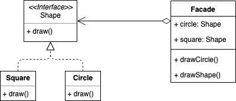

# Facade Pattern
外观模式
## 概念
为子系统提供一组统一的接口，通过定义一组高层接口让子系统更易用

> 别名又称为门面外观模式

## 使用场景
* 解决系统易用性问题：隐藏系统的复杂性，提供一组简单易用的接口；
* 解决项目分层问题：使用外观模式来定义子系统各层次的入口，子系统之间使用外观来进行交互（如MVC分层or面向接口编程）;

## 实现方式

### Java Sample
```java
public interface Shape { 
  void draw(); 
}

public class Square implements Shape { 
  @Override public void draw() { 
    // Do Something
  }
}

public class Circle implements Shape { 
  @Override public void draw() { 
    // Do Something
  }
}

public class Facade { 
  private Shape circle; 
  private Shape square; 

  public Facade () { 
    this.circle = new Circle(); 
    this.square = new Square(); 
  } 

  public void drawCircle(){ 
    circle.draw(); 
  } 
  public void drawSquare(){ 
    square.draw(); 
  }
}

// 使用者
Facade facade = new ShapeMaker(); 
facade.drawCircle(); 
facade.drawSquare();
```

### Golang Sample
```golang
type Shape interface {
  draw()
}

type Square struct{}


func (s Square) draw() {
  // Do Something
}

func BuildSquare() Shape { return Square{} }

type Circle struct{}

func (c Circle) draw() {
  // Do Something
}

func BuildCircle() Shape { return Circle{} }

type Facade struct {
  circle Shape
  square Shape
}

func (facade Facade) drawCircle() {
  facade.circle.draw()
}
func (facade Facade) drawSquare() {
  facade.square.draw()
}

func main() {
  var facade = Facade{
    square: BuildSquare(),
    circle: BuildCircle(),
  }
  facade.drawCircle()
  facade.drawSquare()
}
```

## 类图


## 总结反思
外观模式是非常常用的设计模式，常用到你感觉不到它是一种设计模式。