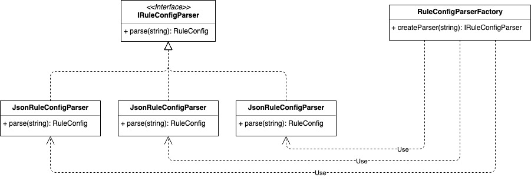

# Factory Pattern
工厂模式

## 概念
TODO

一般来说工厂模式分为三种细分类型：简单工厂、工厂方法和抽象工厂，本教程将会就这三个类型逐一讲解。

## 使用场景
TODO

## 实现方式

### 简单工厂

定义一个工厂类，根据传入的参数不同返回不同的实例，被创建的实例具有共同的父类或接口；

Java Sample

```java
public class RuleConfigSource {
  public RuleConfig load(String path, String fileExtension) {
    IRuleConfigParser parser = RuleConfigParserFactory.createParser(fileExtension);
    if (parser == null) {
      throw new InvalidRuleConfigException("Rule Config file format is not supported:", fileExtension)
     }
    String configText = "";
    RuleConfig ruleConfig = parser.parse(configText);
    return ruleConfig;
  }
}

public class RuleConfigParserFactory {
  public class IRuleConfigParser createParser(String configFormat){
    IRuleConfigParser parser = null;
    if ("json".equalsIgnoreCase(configFormat)) {
      parser = new JsonRuleConfigParser();
    } else if ("xml".equalsIgnoreCase(configFormat)) {
      parser = new XmlRuleConfigParser();
    } else if ("txt".equalsIgnoreCase(configFormat)) {
      parser = new TxtRuleConfigParser();
    }
     return parser;
  }
}
```

Go Sample
```golang
// 共同的接口
type IRuleConfigParser interface {
   parse(string) RuleConfig
}

// 自定义结构体
type RuleConfig struct{}

// 具体产品角色
type JsonRuleConfigParser struct{}

func (JsonRuleConfigParser) parse(string) RuleConfig { return RuleConfig{} }

func NewJsonRuleConfigParser() IRuleConfigParser { return JsonRuleConfigParser{} }

type XmlRuleConfigParser struct{}

func (XmlRuleConfigParser) parse(string) RuleConfig { return RuleConfig{} }

func NewXmlRuleConfigParser() IRuleConfigParser { return XmlRuleConfigParser{} }

type TxtRuleConfigParser struct{}

func (TxtRuleConfigParser) parse(string) RuleConfig { return RuleConfig{} }

func NewTxtRuleConfigParser() IRuleConfigParser { return TxtRuleConfigParser{} }

// 工厂角色
type RuleConfigParserFactory struct{}

func (RuleConfigParserFactory) createParser(configFormat string) IRuleConfigParser {
  var parser IRuleConfigParser
  if "json" == strings.ToLower(configFormat) {
    parser = NewJsonRuleConfigParser()
  } else if "xml" == strings.ToLower(configFormat) {
    parser = NewXmlRuleConfigParser()
  } else if "txt" == strings.ToLower(configFormat) {
    parser = NewTxtRuleConfigParser()
  }
  return parser
}

func NewRuleConfigParserFactory() RuleConfigParserFactory {
  return RuleConfigParserFactory{}
}

// 使用方
type RuleConfigSource struct{}

func (RuleConfigSource) load(path, fileExtension string) RuleConfig {
  var ruleConfig RuleConfig
  parser := NewRuleConfigParserFactory().createParser(fileExtension)
  if parser == nil {
    return ruleConfig
  }
  configText := ""
  ruleConfig = parser.parse(configText)
  return ruleConfig
}
```

从上述的Sample中我们可以观察到几个关键对象：抽象产品接口（IRuleConfigParser）、具体产品角色（JsonRuleConfigParser）和工厂角色（RuleConfigParserFactory），它们是简易工厂的重要组成部分。

类图如下：



另外我们可以发现上述的Sample其实存在优化的空间，我们每次调用RuleConfigParserFactory的createParser时都要创建一个新的parser，实际上parser可以复用，为了节省内存和对象的时间，我们可以先将parser创建然后缓存起来，当调用createParser的时候直接从缓存中取出parser对象使用。

Java Sample

```java
public class RuleConfigParserFactory {
    private static final Map<String, RuleConfigParser> cacheParser = new HashMap<>()
    static {
        cacheParser.put("json", new JsonRuleConfigParser());
        cacheParser.put("xml", new XmlRuleConfigParser());
        cacheParser.put("txt", new TxtRuleConfigParser());
    }
    
    public class IRuleConfigParser createParser(String configFormat){
        if (configFormat == null || configFormat.isEmpty()) {
             return null;
        }
        IRuleConfigParser parser = cacheParser.get(configFormat.toLowerCase());
        return parser;
    }
}
```


Go Sample
```golang
type RuleConfigParserFactory struct {
   cacheParser map[string]IRuleConfigParser
}

func (factory RuleConfigParserFactory) createParser(configFormat string) IRuleConfigParser {
   if configFormat == "" {
      return nil
   }
   return factory.cacheParser[configFormat]
}

func NewRuleConfigParserFactory() *RuleConfigParserFactory {
   factory := new(RuleConfigParserFactory)
   factory.cacheParser["json"] = new(JsonRuleConfigParser)
   factory.cacheParser["xml"] = new(XmlRuleConfigParser)
   factory.cacheParser["txt"] = new(TxtRuleConfigParser)

   return factory
}
```
总结：简单工厂的代码实现中，有多出if分支，有违背开发原则，但在没有太多parser或者不需要频繁添加parser的情况下，也是没有太大问题的。