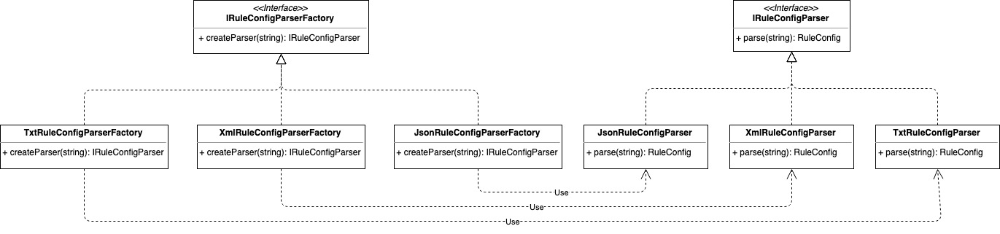
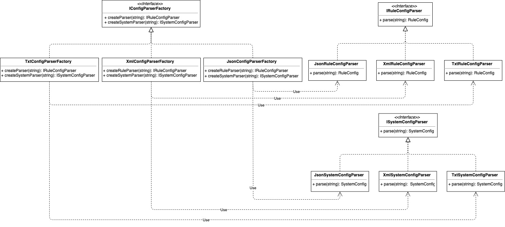

# Factory Pattern
工厂模式
- [Factory Pattern](#factory-pattern)
  - [概念](#概念)
  - [使用场景](#使用场景)
  - [实现方式](#实现方式)
    - [简单工厂](#简单工厂)
      - [概念](#概念-1)
      - [示例](#示例)
        - [Java Sample](#java-sample)
        - [Go Sample](#go-sample)
      - [类图](#类图)
      - [优化改进](#优化改进)
        - [Java Sample](#java-sample-1)
        - [Go Sample](#go-sample-1)
      - [总结反思](#总结反思)
    - [工厂方法](#工厂方法)
      - [概念](#概念-2)
      - [示例](#示例-1)
        - [Java Sample](#java-sample-2)
        - [Go Sample](#go-sample-2)
      - [类图](#类图-1)
      - [总结反思](#总结反思-1)
    - [抽象工厂](#抽象工厂)
      - [示例](#示例-2)
        - [Java Sample](#java-sample-3)
        - [Go Sample](#go-sample-3)
      - [类图](#类图-2)

## 概念
工厂模式是最常用的设计模式之一，它属于创建型模式，提供了一种创建对象的最佳方式。

一般来说工厂模式分为三种细分类型：简单工厂、工厂方法和抽象工厂，本教程将会就这三个类型逐一讲解。

## 使用场景
+ 单个对象的创建过程比较复杂，如需要结合其他类对象做各种初始化操作等场景;
+ 常用在需要需要动态地根据不同的类型来创建不同的对象，即代码中存在大量的if-else分支判断;

## 实现方式

### 简单工厂

#### 概念
定义一个工厂类，根据传入的参数不同返回不同的实例，被创建的实例具有共同的父类或接口；

#### 示例

##### Java Sample

<details>

```java
public class RuleConfigSource {
  public RuleConfig load(String path, String fileExtension) {
    IRuleConfigParser parser = RuleConfigParserFactory.createParser(fileExtension);
    if (parser == null) {
      throw new InvalidRuleConfigException("Rule Config file format is not supported:", fileExtension)
     }
    String configText = "";
    RuleConfig ruleConfig = parser.parse(configText);
    return ruleConfig;
  }
}

public class RuleConfigParserFactory {
  public class IRuleConfigParser createParser(String configFormat){
    IRuleConfigParser parser = null;
    if ("json".equalsIgnoreCase(configFormat)) {
      parser = new JsonRuleConfigParser();
    } else if ("xml".equalsIgnoreCase(configFormat)) {
      parser = new XmlRuleConfigParser();
    } else if ("txt".equalsIgnoreCase(configFormat)) {
      parser = new TxtRuleConfigParser();
    }
     return parser;
  }
}
```
</details>

##### Go Sample

<details>

```golang
// 共同的接口
type IRuleConfigParser interface {
  parse(string) RuleConfig
}

// 自定义结构体
type RuleConfig struct{}

// 具体产品角色
type JsonRuleConfigParser struct{}

func (JsonRuleConfigParser) parse(string) RuleConfig { return RuleConfig{} }

type XmlRuleConfigParser struct{}

func (XmlRuleConfigParser) parse(string) RuleConfig { return RuleConfig{} }

type TxtRuleConfigParser struct{}

func (TxtRuleConfigParser) parse(string) RuleConfig { return RuleConfig{} }

// 工厂角色
type RuleConfigParserFactory struct{}

func (RuleConfigParserFactory) createParser(configFormat string) IRuleConfigParser {
  var parser IRuleConfigParser
  if "json" == strings.ToLower(configFormat) {
    parser = new(JsonRuleConfigParser)
  } else if "xml" == strings.ToLower(configFormat) {
    parser = new(XmlRuleConfigParser)
  } else if "txt" == strings.ToLower(configFormat) {
    parser = new(TxtRuleConfigParser)
  }
  return parser
}

func NewRuleConfigParserFactory() RuleConfigParserFactory {
  return RuleConfigParserFactory{}
}

// 使用方
type RuleConfigSource struct{}

func (RuleConfigSource) load(path, fileExtension string) RuleConfig {
  var ruleConfig RuleConfig
  parser := NewRuleConfigParserFactory().createParser(fileExtension)
  if parser == nil {
    return ruleConfig
  }
  configText := ""
  ruleConfig = parser.parse(configText)
  return ruleConfig
}
```

</details>

#### 类图

从上述的Sample中我们可以观察到几个关键对象：抽象产品接口（IRuleConfigParser）、具体产品角色（JsonRuleConfigParser）和工厂角色（RuleConfigParserFactory），它们是简易工厂的重要组成部分，类如如下：


#### 优化改进

另外我们可以发现上述的Sample其实存在优化的空间，我们每次调用RuleConfigParserFactory的createParser时都要创建一个新的parser，实际上parser可以复用，为了节省内存和对象的时间，我们可以先将parser创建然后缓存起来，当调用createParser的时候直接从缓存中取出parser对象使用。

##### Java Sample

<details>

```java
public class RuleConfigParserFactory {
  private static final Map<String, RuleConfigParser> cacheParser = new HashMap<>()
  static {
    cacheParser.put("json", new JsonRuleConfigParser());
    cacheParser.put("xml", new XmlRuleConfigParser());
    cacheParser.put("txt", new TxtRuleConfigParser());
  }
  
  public class IRuleConfigParser createParser(String configFormat){
    if (configFormat == null || configFormat.isEmpty()) {
         return null;
    }
    IRuleConfigParser parser = cacheParser.get(configFormat.toLowerCase());
    return parser;
  }
}
```

</details>

##### Go Sample

<details>

```golang
type RuleConfigParserFactory struct {
  cacheParser map[string]IRuleConfigParser
}

func (factory RuleConfigParserFactory) createParser(configFormat string) IRuleConfigParser {
  if configFormat == "" {
    return nil
  }
  return factory.cacheParser[configFormat]
}

func NewRuleConfigParserFactory() *RuleConfigParserFactory {
  factory := new(RuleConfigParserFactory)
  factory.cacheParser["json"] = new(JsonRuleConfigParser)
  factory.cacheParser["xml"] = new(XmlRuleConfigParser)
  factory.cacheParser["txt"] = new(TxtRuleConfigParser)

  return factory
}
```
</details>

#### 总结反思
简单工厂的代码实现中，有多出if分支，有违背开发原则，但在没有太多parser或者不需要频繁添加parser的情况下，也是没有太大问题的。

### 工厂方法

对于上述的例子中，如果我们非得要将if分支逻辑去掉，可以考虑使用工厂方法，利用多态的实现思路进行重构。

#### 概念
定义一个创建对象的接口，但让实现这个接口的类来决定示例实例化哪个类，即工厂方法让类的实例化推迟到子类中进行；

#### 示例

##### Java Sample

<details>

```java
public interface IRuleConfigParserFactory {
  IRuleConfigParser createParser();
}

public class JsonRuleConfigParserFactory implements IRuleConfigParserFactory {
  @Override
  public IRuleConfigParser createParser() {
    return new JsonRuleConfigParser();
  }
}

public class XmlRuleConfigParserFactory implements IRuleConfigParserFactory {
  @Override
  public IRuleConfigParser createParser() {
    return new XmlRuleConfigParser();
  }
}

public class TxtRuleConfigParserFactory implements IRuleConfigParserFactory {
  @Override
  public IRuleConfigParser createParser() {
    return new TxtRuleConfigParser();
  }
}

public class RuleConfigParserFactoryMap {
  private static final Map<String, IRuleConfigParserFactory> cacheParserFactory = new HashMap<>()
  static {
    cacheParserFactory.put("json", new JsonRuleConfigParserFactory());
    cacheParserFactory.put("xml", new XmlRuleConfigParserFactory());
    cacheParserFactory.put("txt", new TxtRuleConfigParserFactory());
  }
  
  public class IRuleConfigParserFactory getParserFactory(String type){
    if (type == null || type.isEmpty()) {
         return null;
    }
    IRuleConfigParserFactory parserFactory = cacheParserFactory.get(configFormat.toLowerCase());
    return parserFactory;
  }
}

public class RuleConfigSource {
  public RuleConfig load(String path, String fileExtension) {
    IRuleConfigParserFactory parserFactory = RuleConfigParserFactoryMap.getParserFactory(fileExtension);
    if (parserFactory == null) {
      throw new InvalidRuleConfigException("Rule Config file format is not supported:", fileExtension)
    }
    IRuleConfigParser parser = parserFactory.createParser();
    String configText = "";
    RuleConfig ruleConfig = parser.parse(configText);
    return ruleConfig;
  }
}
```
</details>

##### Go Sample

<details>

```golang
// 自定义结构体
type RuleConfig struct{}

// 抽象产品接口
type IRuleConfigParser interface {
  parse(string) RuleConfig
}

// 抽象工厂接口
type IRuleConfigParserFactory interface {
  createParser() IRuleConfigParser
}

// 具体产品角色
type JsonRuleConfigParser struct{}

func (JsonRuleConfigParser) parse(string) RuleConfig { return RuleConfig{} }

// 具体工厂角色
type JsonRuleConfigParserFactory struct{}

func (JsonRuleConfigParserFactory) createParser() IRuleConfigParser {
  return new(JsonRuleConfigParser)
}

type XmlRuleConfigParser struct{}

func (XmlRuleConfigParser) parse(string) RuleConfig { return RuleConfig{} }

type XmlRuleConfigParserFactory struct{}

func (XmlRuleConfigParserFactory) createParser() IRuleConfigParser {
  return new(XmlRuleConfigParser)
}

type TxtRuleConfigParser struct{}

func (TxtRuleConfigParser) parse(string) RuleConfig { return RuleConfig{} }

type TxtRuleConfigParserFactory struct{}

func (TxtRuleConfigParserFactory) createParser() IRuleConfigParser {
  return new(TxtRuleConfigParser)
}

type RuleConfigParserFactory struct {
  cacheParserFactory map[string]IRuleConfigParserFactory
}

func NewRuleConfigParserFactory() *RuleConfigParserFactory {
  factory := new(RuleConfigParserFactory)
  factory.cacheParserFactory["json"] = new(JsonRuleConfigParserFactory)
  factory.cacheParserFactory["xml"] = new(XmlRuleConfigParserFactory)
  factory.cacheParserFactory["txt"] = new(TxtRuleConfigParserFactory)

  return factory
}

type RuleConfigSource struct{}

func (RuleConfigSource) load(path, fileExtension string) RuleConfig {
  var ruleConfig RuleConfig
  parserFactory := NewRuleConfigParserFactory().cacheParserFactory[fileExtension]
  if parserFactory == nil {
    return ruleConfig
  }
  parser := parserFactory.createParser()

  configText := ""
  ruleConfig = parser.parse(configText)
  return ruleConfig
}
```

</details>

#### 类图
从上述的Sample中我们可以观察四个关键对象：抽象产品接口（IRuleConfigParser）、具体产品角色（JsonRuleConfigParser）、抽象工厂接口（IRuleConfigParserFactory）、具体工厂角色（JsonRuleConfigParserFactory）



#### 总结反思

从上述的例子中我们可以总结出工厂方法使用过程中的一些优缺点：
+ 优点：当我们需要添加新的角色时只需要创建新的parser类和parser factory类，并且在RuleConfigParserFactoryMap类中将新的parser factory对象添加到cache对象中即可，代码改动较少，基本符合开闭原则；
+ 缺点：工厂模式需要额外创建诸多的Factory类，增加代码的复杂性，且此处的每个工厂类只是做简单的创建工作，功能单薄，也显得多余；

### 抽象工厂
它的应用场景比较特殊，没有前面两种常用，主要是提供一个超级工厂来创建其他工厂；

在上面的例子中，类只有一种分类方式，即RuleConfigParser，但如果假设我们即要求按照RuleConfig配置又要按照System配置来分类时，那我们的工厂数量就会成倍增加，这个时候我们可以考虑让一个工厂创建多个不同类型（即RuleConfig和System）的对象。

#### 示例

##### Java Sample

<details>

```java
public interface IConfigParserFactory {
  IRuleConfigParser createRuleParser();
  ISystemConfigParser createSystemParser();
}

public class JsonConfigParserFactory implements IConfigParserFactory {
  @Override
  public IRuleConfigParser createRuleParser() {
    return new JsonRuleConfigParser();
  }
  public ISystemConfigParser createSystemParser() {
    return new JsonSystemConfigParser();
  }
}

public class XmlConfigParserFactory implements IConfigParserFactory {
  @Override
  public IRuleConfigParser createRuleParser() {
    return new XmlRuleConfigParser();
  }
  public ISystemConfigParser createSystemParser() {
    return new XmlSystemConfigParser();
  }
}

public class TxtConfigParserFactory implements IConfigParserFactory {
  @Override
  public IRuleConfigParser createRuleParser() {
    return new TxtRuleConfigParser();
  }
  public ISystemConfigParser createSystemParser() {
    return new TxtSystemConfigParser();
  }
}

public class ConfigParserFactoryMap {
  private static final Map<String, IConfigParserFactory> cacheParserFactory = new HashMap<>()
  static {
    cacheParserFactory.put("json", new JsonConfigParserFactory());
    cacheParserFactory.put("xml", new XmlConfigParserFactory());
    cacheParserFactory.put("txt", new TxtConfigParserFactory());
  }
  
  public class IConfigParserFactory getConfigParserFactory(String type){
    if (type == null || type.isEmpty()) {
      return null;
    }
    IRuleConfigParserFactory parserFactory = cacheParserFactory.get(configFormat.toLowerCase());
    return parserFactory;
  }
}

public class RuleConfigSource {
  public RuleConfig load(String path, String fileExtension) {
    IConfigParserFactory parserFactory = RuleConfigParserFactoryMap.getParserFactory(fileExtension);
    if (parserFactory == null) {
      throw new InvalidRuleConfigException("Rule Config file format is not supported:", fileExtension)
    }
    IRuleConfigParser parser = parserFactory.createRuleParser();
    String configText = "";
    RuleConfig ruleConfig = parser.parse(configText);
    return ruleConfig;
  }
}
```

</details>

##### Go Sample

<details>

```golang
// 自定义结构体
type RuleConfig struct{}

type SystemConfig struct{}

// 抽象工厂接口
type IConfigParserFactory interface {
  createRuleParser() IRuleConfigParser
  createSystemParser() ISystemConfigParser
}

// 抽象产品接口
type IRuleConfigParser interface {
  parse(string) RuleConfig
}

type ISystemConfigParser interface {
  parse(string) SystemConfig
}

// 具体工厂角色
type JsonConfigParserFactory struct{}

func (JsonConfigParserFactory) createRuleParser() IRuleConfigParser {
  return new(JsonRuleConfigParser)
}

func (JsonConfigParserFactory) createSystemParser() ISystemConfigParser {
  return new(JsonSystemConfigParser)
}

// 具体产品角色
type JsonRuleConfigParser struct{}

func (JsonRuleConfigParser) parse(string) RuleConfig { return RuleConfig{} }

type JsonSystemConfigParser struct{}

func (JsonSystemConfigParser) parse(string) SystemConfig { return SystemConfig{} }

type XmlConfigParserFactory struct{}

func (XmlConfigParserFactory) createRuleParser() IRuleConfigParser {
  return new(XmlRuleConfigParser)
}

func (XmlConfigParserFactory) createSystemParser() ISystemConfigParser {
  return new(XmlSystemConfigParser)
}

type XmlRuleConfigParser struct{}

func (XmlRuleConfigParser) parse(string) RuleConfig { return RuleConfig{} }

type XmlSystemConfigParser struct{}

func (XmlSystemConfigParser) parse(string) SystemConfig { return SystemConfig{} }

type TxtConfigParserFactory struct{}

func (TxtConfigParserFactory) createRuleParser() IRuleConfigParser {
  return new(TxtRuleConfigParser)
}

func (TxtConfigParserFactory) createSystemParser() ISystemConfigParser {
  return new(TxtSystemConfigParser)
}

// 具体产品角色
type TxtRuleConfigParser struct{}

func (TxtRuleConfigParser) parse(string) RuleConfig { return RuleConfig{} }

type TxtSystemConfigParser struct{}

func (TxtSystemConfigParser) parse(string) SystemConfig { return SystemConfig{} }

type RuleConfigParserFactory struct {
  cacheParserFactory map[string]IConfigParserFactory
}

func NewRuleConfigParserFactory() *RuleConfigParserFactory {
  factory := new(RuleConfigParserFactory)
  factory.cacheParserFactory["json"] = new(JsonConfigParserFactory)
  factory.cacheParserFactory["xml"] = new(XmlConfigParserFactory)
  factory.cacheParserFactory["txt"] = new(TxtConfigParserFactory)

  return factory
}

type RuleConfigSource struct{}

func (RuleConfigSource) load(path, fileExtension string) RuleConfig {
  parserFactory := NewRuleConfigParserFactory().cacheParserFactory[fileExtension]

  var ruleConfig RuleConfig
  if parserFactory == nil {
    return ruleConfig
  }
  parser := parserFactory.createRuleParser()

  configText := ""
  ruleConfig = parser.parse(configText)
  return ruleConfig
}
```

</details>

#### 类图
