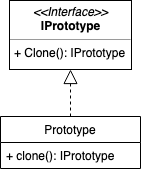

# Prototype Pattern
原型模式

- [Prototype Pattern](#prototype-pattern)
  - [概念](#概念)
  - [使用场景](#使用场景)
  - [实现方式](#实现方式)
    - [Java Sample](#java-sample)
    - [Go Sample](#go-sample)
  - [类图](#类图)
  - [总结反思](#总结反思)

## 概念
利用已有的对象/原型并通过拷贝的形式来创建新的对象

## 使用场景
类或对象的创建成本比较高，而同一个类的不同对象之间差别不大

## 实现方式

### Java Sample

```java
public abstract class IPrototype {
  public abstract Prototype clone();
}

public class Prototype extends IPrototype {
  public Prototype clone() {
    Prototype prototype = new Prototype();
    return prototype;
  }
}
```

### Go Sample

```golang
type IPrototype interface {
  Clone() IPrototype
}

type Prototype struct{}

func (prototype *Prototype) Clone() IPrototype {
  pointer := *prototype
  return &pointer
}
```

原型模式要求对象实现一个可以克隆自身的接口，通过这个接口可以复制对象来创建新的实例，而无需再通过new来创建。

## 类图


## 总结反思
原型模式的原理和实现很简单，它有两种实现方式需要注意：深拷贝和浅拷贝。浅拷贝只会复制对象中基本类型的数据和引用类型数据的内存地址，不会递归地复制引用对象，以及引用对象引用的引用对象。而深拷贝得到的是一份完完全全独立的对象，但这个过程更加耗时和消耗内存空间。一般来说可以通过序列化和反序列化对象来实现深拷贝。
