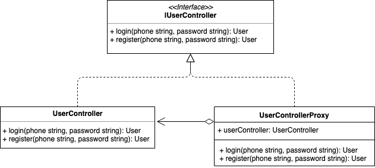

# Proxy Pattern
代理模式

## 概念
在不改变原始类代码的情况下，通过引入代理类来给原始类提供附加功能。

## 使用场景
+ 远程代理，如RPC框架，通过将网络通信、数据编码等细节隐藏起来，从而使开发者可以像本地使用函数一样；
+ 缓冲代理，为某操作提供临时的缓存存储空间，从而避免某些方法的重复执行，优化系统性能，如在Web项目中给Dao层添加缓冲代理类以提供缓存功能；
+ 虚拟代理，延迟初始化，即在真实对象创建成功之前虚拟代理扮演真实对象的替身，当真实对象创建完成后虚拟代理再将用户的请求转发给真实对象，常用在占用系统资源较多或者加载时间较长的对象中，如加载图片时可以先使用loading图，等待图片加载完成后再替换成真实图片；
+ 保护代理，实现控制保护，如只希望客户端操作系统的部分内容；
+ 智能引用，可以在没有客户端使用某个重要对象时立即销毁该服务对象，释放底层系统资源；
+ 业务场景，如业务系统中非功能性需求：监控、统计、鉴权、限流、事务、幂等和日志等，通过代理类添加附加功能从而与业务功能解耦；


## 实现方式

### 静态代理
基于接口而非实现编程，代理类通过实现和原始类相同的接口或者是继承相同的父类，再将原始类进行替换。

#### Java Sample

```java
public interface IUserController {
    UserVo login(String phonne, String password);
    UserVo register(String phonne, String password);
}

public class UserController implements IUserController {
    @Override
    public login(String phonne, String password) {
        // 实现登录逻辑并返回UserVO
    }
    @Override
    public register(String phonne, String password) {
        // 实现注册逻辑并返回UserVO
    }
}

public class UserControllerProxy implements IUserController {
    private UserController userController
    
    public UserControllerProxy(UserController userController) {
        this.userController = userController;
    }
    
    @Override
    public login(String phonne, String password) {
        // 委托
        UserVo userVo = userController.login(phone, password)
        // 省略代理实现的逻辑，如监控、统计、鉴权等操作
        return userVo
    }
    @Override
    public register(String phonne, String password) {
        // 委托
        UserVo userVo = userController.register(phone, password)
        // 省略代理实现的逻辑，如监控、统计、鉴权等操作
        return userVo
    }
}

// 因为原始类和代理类实现相同的接口，因此在使用的过程中将UserController替换成UserControllerProxy即可，不需要做太多代码改动
IUserController userController = new UserControllerProxy(new UserController())
```

#### Golang Sample
```golang
type IUserController interface {
   Login(phone, password string) User
   Register(phone, password string) User
}

type UserController struct{}

func (UserController) Login(phone, password string) User {
   return User{}
}
func (UserController) Register(phone, password string) User {
   return User{}
}

type UserControllerProxy struct {
   userController IUserController
}

func (proxy UserControllerProxy) Login(phone, password string) User {
   // 委托
   user := proxy.userController.Login(phone, password)
   // 省略代理实现的逻辑，如监控、统计、鉴权等操作
   return user
}

func (proxy UserControllerProxy) Register(phone, password string) User {
   user := proxy.userController.Register(phone, password)
   return user
}

func main() {
   var phone, password string
   userController := UserControllerProxy{userController: new(UserController)}
   userController.Login(phone, password)
   userController.Register(phone, password)
}
```
代理类UserControllerProxy和原始类UserController实现想同的接口IUserController，原始类UserController只负责业务功能，代理类UserControllerProxy负责在业务代码前后附加其他逻辑，并通过委托的方式调用原始类来执行业务代码。另外如果原始类没有定义接口或者我们没有办法直接修改原始类来增加接口的情况下，我们可以让代理类继承原始类，然后扩展附加功能（其实不继承也没关系，在上面包一层就好了）。

#### 总结反思
静态代理主要的问题在于如果需要添加附加原始类过多，那么会导致项目中类的个数成倍增加，势必会增加代码的维护成本，而且每个代理类的代码都有重复的部分，也增加了不必要的开发成本，这个时候我们可以考虑使用动态代理。

### 动态代理
在运行时动态地创建原始类对应的代理类并替换原始类运行。

#### Java Sample
在Java中实现动态代理是非常容易的事情，其本身提供动态代理的语法（其实就是反射），我们来看一下示例代码：

```java
public class ProxyHandler implements InvocationHandler {
    private Object target;

    public Object createProxy(Object target) {
        this.target = target;
        //取得代理对象
        return Proxy.newProxyInstance(target.getClass().getClassLoader(), target.getClass().getInterfaces(), this);
    }

    @Override
    public Object invoke(Object proxy, Method method, Object[] args) throws Throwable {
        Object result = method.invoke(target, args);
        // 省略代理实现的逻辑，如监控、统计、鉴权等操作
        return result;
    }
}


ProxyHandler proxy = new ProxyHandler();
IUserController userController = (IUserController) proxy.createProxy(new UserController());
```

动态代理在Java中非常常见，Java Spring AOP底层的实现原理也是基于动态代理，但是在Golang中笔者还未确定是否可实现以及如何实现，等待大佬指点。

## 类图


## 总结反思
代理模式可以使得模块的功能和职责更加清晰和易拓展，但由于增加了代理对象，可能会存在请求的处理速度变慢。